# Mirror Me: Self-Affirmation Text Generator Using Fine-Tuned GPT-2

### Best Affirmation Example  
[See Best Output Here](#best-generated-affirmations)

### How to Run the GUI and Generate Text:  
[Accessing and Running on Quest](#accessing-and-running-project-on-quest)

---

## Table of Contents
* [Overview](#overview)
* [What This Project Actually Does](#what-this-project-actually-does)
* [What You Can Use This For](#what-you-can-use-this-for)
* [Model Architecture](#model-architecture)
* [Folder Structure](#folder-structure)
* [Accessing and Running Project on Quest](#accessing-and-running-project-on-quest)
* [Extra Criteria - GUI Overview](#extra-criteria---gui-overview)
* [Sample Generated Affirmations](#additional-generated-affirmations)
* [Training Loss Graph](#training-loss-graph)
* [Data Preparation & Transfer](#data-preparation--transfer)
* [Exploratory Data Analysis (EDA)](#exploratory-data-analysis-eda)
* [Model Training on Quest (Northwestern Quest)](#model-training-on-quest-northwestern-quest)
* [Evaluation Metrics (Test Set)](#evaluation-metrics-test-set)
* [Future Improvements](#future-improvements)
* [References and Tools Used](#references-and-tools-used)


---

## Overview
**Mirror Me** is an AI-powered affirmation generator that takes in journal-style text and optionally an emotional label (e.g., "gratitude", "worry") to generate a comforting, self-affirming response using a fine-tuned GPT-2 language model.

---

## What This Project Actually Does
Fine-tunes a GPT-2 model on a paired dataset of emotional tweets and positive affirmations. At inference time, the user can provide a journal-style entry and an optional emotion, and the model generates an appropriate affirmation.

### What you get:
* A generative language model that outputs affirmations based on emotional input
* An interactive Gradio interface for testing
* Batch generation & evaluation scripts for large-scale inference

---

## What You Can Use This For
* Mental health & wellness journaling tools  
* Chatbot enhancement with emotion-sensitive replies  
* AI-driven encouragement apps  
* Educational tools for emotional literacy

---

## Model Architecture
* **Base Model**: GPT-2 (small)  
* **Conditioning**: Optional emotion tag (e.g., "[GRATITUDE]") prepended  
* **Loss Function**: Causal Language Modeling with CrossEntropyLoss  
* **Training Epochs**: 35  
* **Dataset Size**: 114,000+ tweet-affirmation pairs  

---

## Folder Structure

```
Self_Affirmation_Text_Generator/
├── configs/
│   └── config.yaml
├── data/
│   ├── batch_inputs.csv
│   ├── combine_affirmations_tweets_datasets.py
│   ├── eda_paired_dataset.ipynb
│   ├── large_batch_inputs.csv
│   ├── og-emotion-detection-tweets-dataset/
│   │   └── tweet_emotions.csv
│   ├── og-positive-affirmations-dataset/
│   │   └── possitive_affirmation.csv
│   ├── paired_affirmations.csv
│   ├── sample_preview.csv
│   ├── test.csv
│   ├── train.csv
│   └── val.csv
├── flagged/
├── model/
│   └── train_gpt2.py
├── outputs/
│   ├── checkpoints/
│   │   ├── checkpoint-389640/
│   │   └── checkpoint-802200/
│   └── logs/
│       └── (SLURM + TensorBoard logs)
├── results/
│   ├── affirmations_generated/
│   │   └── inference_*.txt
│   ├── batch_affirmations.csv
│   ├── batch_affirmations_evaluated.csv
│   ├── training_loss_curve.png
│   └── eda/
│       ├── affirmation_tag_distribution.png
│       ├── emotion_label_distribution.png
│       ├── emotion_vs_tag_heatmap.png
│       ├── input_length_by_affirmation_tag.png
│       ├── input_length_distribution.png
│       ├── output_length_distribution.png
│       ├── total_input_output_length_distribution.png
│       ├── total_token_distribution.png
│       ├── wordCloud_input_texts.png
│       └── wordCloud_output_texts.png
├── scripts/
│   ├── evaluation.py
│   ├── generate_batch.py
│   ├── generate_inference_affirmation.py
│   ├── plot_loss.py
│   └── split_dataset.py
├── static/
│   └── heart_icon.png
├── .gitignore
├── gui.py
├── LICENSE
├── README.md
├── requirements.txt
├── run_gui.sh
├── run_project.sh
├── setup_env.sh
├── submit_evaluation_test_data.sh
└── submit_project.sh
```

---

## Accessing and Running Project on Quest

### 1. Log into Quest
```bash
ssh -X your_netid@login.quest.northwestern.edu
```

### 2. Clone the Repo and Setup
```bash
git clone https://github.com/hanna8008/Self_Affirmation_Text_Generator.git
cd Self_Affirmation_Text_Generator
bash setup_env.sh
conda activate affirmgen
```

### 3. Run GUI
```bash
bash run_gui.sh
```

---

## Extra Criteria - GUI Overview

The GUI (built with Gradio) supports:

* Free-text input (journal-style)
* Optional emotion tag
* Real-time output generation

---

## Best Generated Affirmations
| Input                                    | Emotion | Affirmation                                                                                                     |
| ----------------------------------------|---------|------------------------------------------------------------------------------------------------------------------|
| I cried myself to sleep again last night | sad     | I feel God in my heart and in my life. I am overcome with gratitude for the bliss that fills my life today. I am worthy of feeling happy. |
| I cried myself to sleep again last night |         | I feel blessed today. I am overcome with gratitude for the bliss that fills my life. The happiness I feel is felt by everyone around me. |

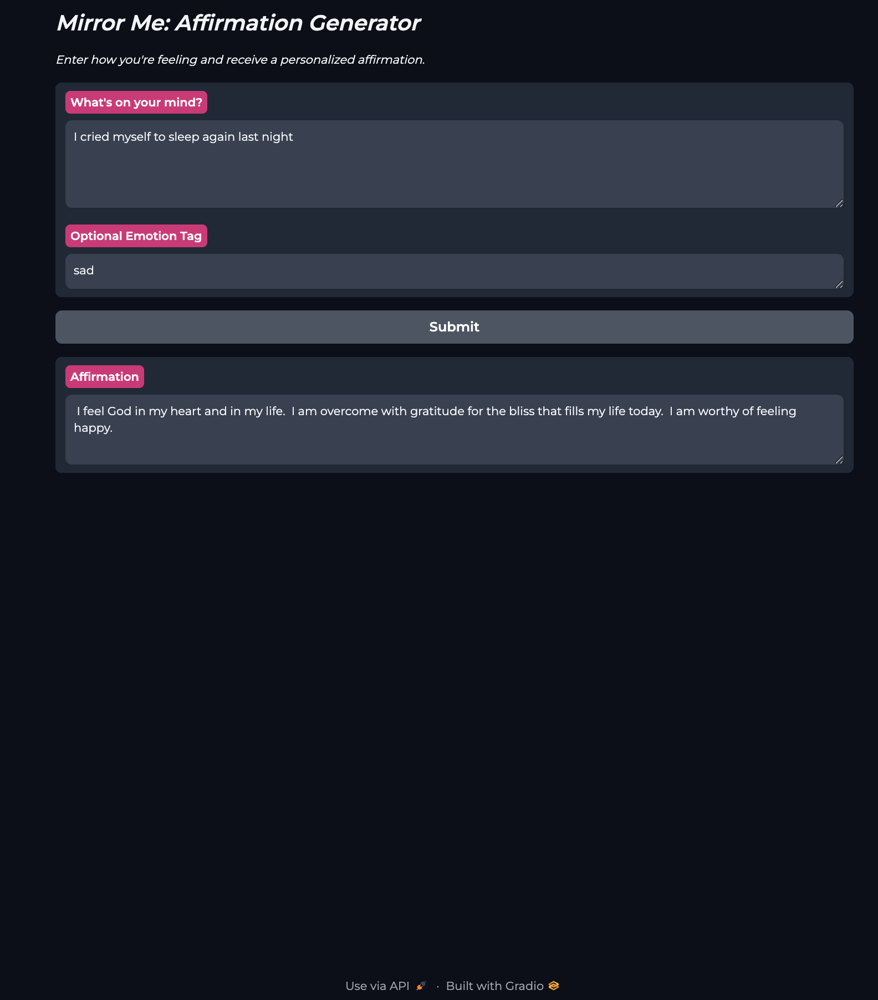
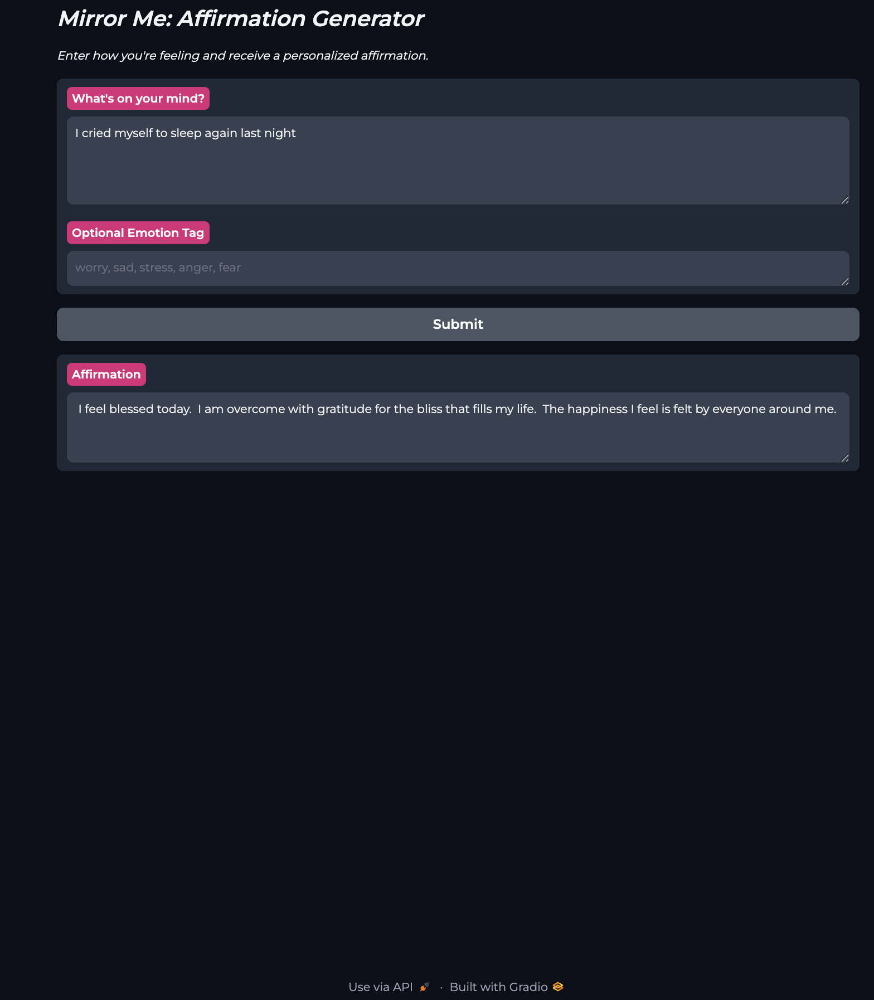


## Additional Generated Affirmations
| Input                                      | Emotion | Affirmation                                                                                                     |
| ------------------------------------------|---------|------------------------------------------------------------------------------------------------------------------|
| I keep overthinking every little thing     | worry   | F for McCoy's initial rant. I think loving thoughts about everyone around me. I am surrounded by loving, caring people. |
| I keep overthinking every little thing     |         | is aKin-khing thing that reminds me of a Scion. My inner joy expands when I share it with others. I share my life with a perfect soul mate. I am surrounded by loving, caring people. |
| I feel so alone                            | sad     | At the moment M'oultas are so sad. I am so grateful for supportive friends and a loving family. I am experiencing wonderful miracles of love and friendships. |
| I feel so alone                            |         | Without my camera. I am romantically contented and open to receive something wonderful today. It is time to start my own garden. |
| Even when I'm with people, I still feel alone | sad  | I feel God in my heart and in my life. I feel great joy and happiness. I am worthy of feeling happy. |
| Even when I'm with people, I still feel alone |       | I feel happy with myself as a person. I overcome everything I can't control. Just give me my 3 points—I feel great joy and happiness. |
| I feel so ugly today                       |         | I am supernaturally beautiful inside out. I am an amazing person. Not a person that u call colorado I am beauty. |
| I feel so ugly today                       |         | This is not good. Why am I so gorgeous. Why am my beauty so beautiful. |
| I feel so ugly today                       | sad     | I am manifesting my desired facial and body features now. And my hair is showered from yesterday. My beauty radiate vibrantly from within. |

---


* Longer Text Entry
1. I keep replaying the conversation over and over in my head. What if I said the wrong thing? What if this ruins everything I've worked so hard for? I can't focus on anything else, it's like my chest won't loosen. I just want to know it'll be okay | worry | 
1. I keep replaying the conversation over and over in my head. What if I said the wrong thing? What if this ruins everything I've worked so hard for? I can't focus on anything else, it's like my chest won't loosen. I just want to know it'll be okay | | 
2. It's not even that anything bad happened today, I just feel... hollow. Like I'm walking through a fog that won't lift, pretending to be present when I'm really not. I laughed at a joke earlier, but it didn't feel real. Nothing does lately | empty | 
2. It's not even that anything bad happened today, I just feel... hollow. Like I'm walking through a fog that won't lift, pretending to be present when I'm really not. I laughed at a joke earlier, but it didn't feel real. Nothing does lately | | 
3. Every time I see them, my stomach twists. The lies, the manipulation, they think no one sees it, but I do. I've tried to be the bigger person, but I'm down swallowing my rage. They don't deserve my silence anymore | anger | 
3. Every time I see them, my stomach twists. The lies, the manipulation, they think no one sees it, but I do. I've tried to be the bigger person, but I'm down swallowing my rage. They don't deserve my silence anymore | | 

---

## Training Loss Graph

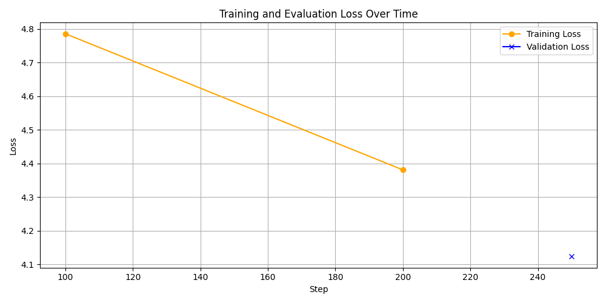

* This graph visualizes training and validation loss over time, helping monitor model learning and check for overfitting during GPT-2 fine-tuning
* Training loss decreased from 4.79 to 4.38, showing that the model is learning; the single validation loss point at ~4.13 suggests decent generalization
* Only one validation point was logged, so future improvements include enabling more frequent validation logging to plot a full curve


---

## Data Preparation & Transfer

* Combined tweet+affirmation data into `paired_affirmations.csv`
* Cosine similarity computed using sentence-transformers
* Transferred to Quest using `scp` or GitHub

---

## Exploratory Data Analysis (EDA)
This project includes several visualizations that explore the data of the new dataset that was made by combining the affirmations dataset and emotions detection tweets dataset.

### Affirmation Tag Distribution
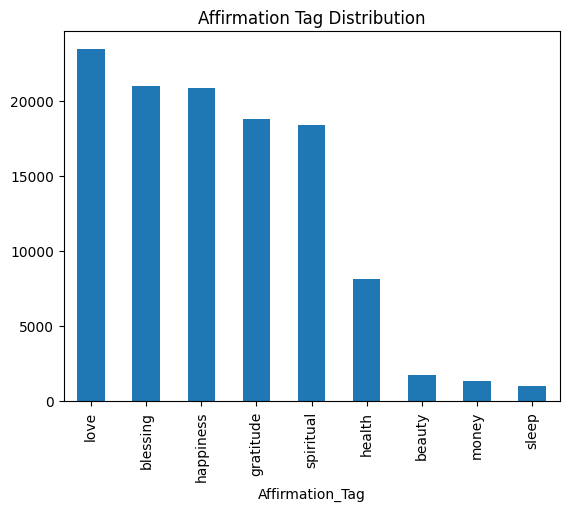
* Displays how frequently each tag (e.g., love, happiness, health) appears in the dataset.
* Tags like love, blessing, and happiness dominate, suggesting common themes of encouragement.
* Tags like money, sleep, and beauty are less represented, indicating limited training data for those tones.

---

### Emotion Label Distribution
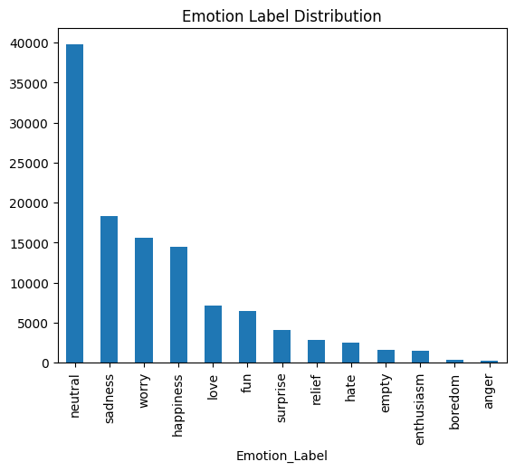
* Visualizes how emotional inputs (e.g., neutral, sadness, worry) are distributed.
* The dataset skews heavily toward neutral, followed by sadness, worry, and love.
* This skew affects the diversity of conditioning and model generalizability.

---

### Emotion vs. Affirmation Tag Heatmap
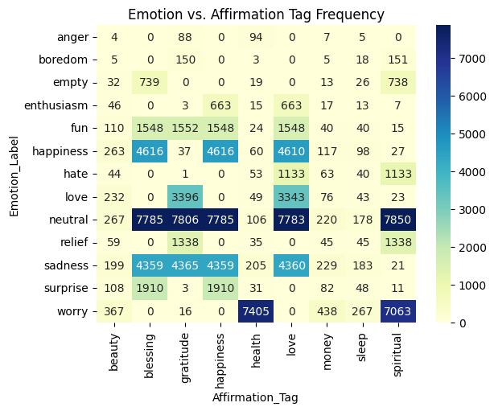
* Cross-tabulation of emotional input vs. the generated affirmation type.
* Useful to detect if certain emotions bias toward specific responses (e.g., sadness → blessings).
* Shows strong pairing patterns between neutral and nearly all tags, with worry and sadness also linked to spiritual or gratitude-based affirmations.

---

### Input Length Distribution
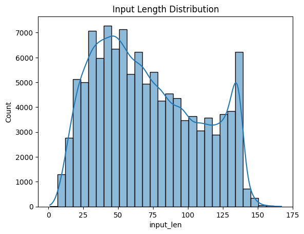
* Histogram of character count in inputs.
* Centered around 40–100 characters, with most tweets under the 140-character Twitter limit.
* Helps guide padding/truncation strategies during model training.

---

### Output Length Distribution
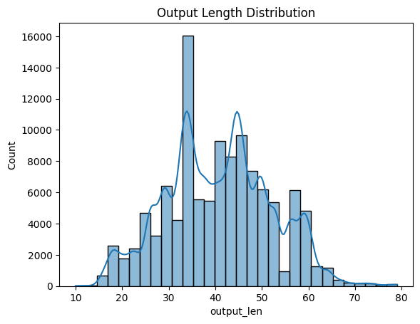
* Histogram of character count in affirmations.
* Majority fall between 20–60 characters, confirming concise affirmations.
* Informative for model generation constraints.

---

### Input Length by Affirmation Tag
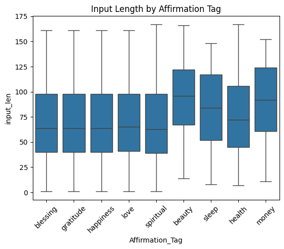
* Boxplot showing variation in input length by tag.
* money and beauty responses tend to stem from longer tweets, while love and blessing inputs are shorter and more frequent.

---

### Total Input + Output Length Distribution
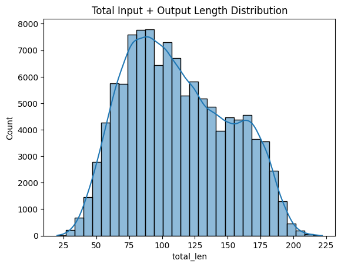
* Confirms most total lengths remain under 200 characters.
* Useful when verifying overall pair brevity for transformer limits.

---

### Total Token Distribution (GPT-2 Based)
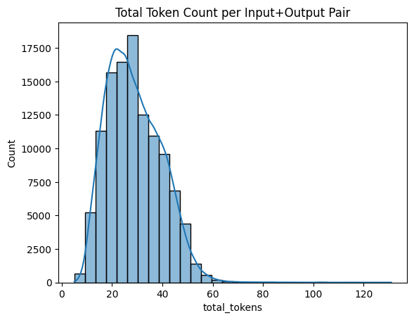
* Token count per input/output pair based on GPT-2 tokenizer.
* Most pairs are under 60 tokens, far below GPT-2’s 1024-token limit, allowing ample room for padding or longer responses.

---

### WordCloud: Input
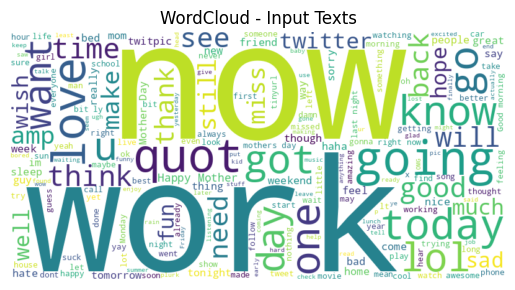
* The input word cloud shows frequent terms like "work," "now," and "think," reflecting common stressors.

---

### WordCloud: Output
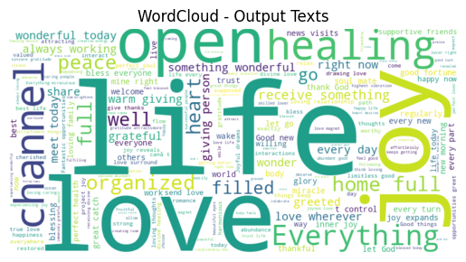
* Output clouds are dominated by "love," "feel," "life," and "open," emphasizing the positive reframing used in affirmations.

---

EDA performed in `eda_paired_dataset.ipynb` — run using [Quest Jupyter Notebook Guide](https://services.northwestern.edu/TDClient/30/Portal/KB/ArticleDet?ID=1791)

---

## Model Training on Quest (Northwestern Quest)

Run the following:
```bash
bash submit_project.sh
```

Checkpoints saved in `outputs/checkpoints/`, logs in `outputs/logs/`

---


## Evaluation Metrics (Test Set)

The model's ability to generate relevant and uplifting affirmations was evaluated using three key metrics:

- **Cosine Similarity**: Measures semantic alignment between journal input and the generated affirmation using sentence embeddings.
- **BLEU Score**: Captures token-level n-gram overlap; useful for structural similarity but often low in creative generation tasks like affirmations.
- **ROUGE Score**: Assesses overlap in unigrams (ROUGE-1) and sequence structure (ROUGE-L), indicating how much of the input’s language is preserved in the output.

### Results Summary

| **Metric**             | **Average** | **Best**   |
|------------------------|-------------|------------|
| Cosine Similarity      | 0.1908      | 0.6716     |
| BLEU Score             | 0.0054      | 0.0609     |
| ROUGE-1 (Unigrams)     | 0.0841      | 0.4324     |
| ROUGE-L (LCS)          | 0.0706      | 0.3243     |

---

### Interpretation

- Although average scores are modest (as expected for a creative text task), the **best-case metrics show that some affirmations were highly aligned and meaningful**.
- A **Cosine Similarity of 0.67** at best reflects strong semantic understanding.
- **ROUGE-1 and ROUGE-L** scores indicate that certain outputs preserved emotional cues or language structure from the inputs.
- **Low BLEU scores are acceptable** for this domain, as high-quality affirmations typically use rephrasing, encouragement, and abstraction instead of direct repetition.

---

## Future Improvements

* Expand emotion conditioning with multi-label support
* Integrate journaling streak tracker
* Add metric dashboard (BLEU, ROUGE, Cosine)
* Deploy to HuggingFace Spaces for web access

---

## References and Tools Used

1. [Hugging Face Transformers](https://huggingface.co/transformers/)
2. [Sentence Transformers](https://www.sbert.net/)
3. [Gradio](https://gradio.app/)
4. [Northwestern Quest](https://www.it.northwestern.edu/departments/it-services-support/research/computing/quest/index.html)
